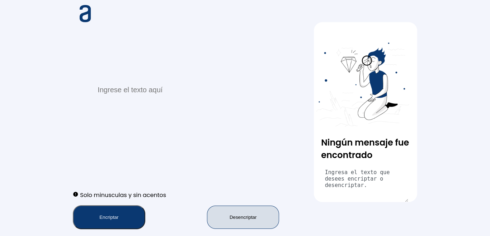

<div align="center"></div>

## <div align="center">🔒 Encriptador de texto</div>

## <div align="center">Este proyecto fue realizado con</div>

<p align="center">
<a href="https://developer.mozilla.org/en-US/docs/Glossary/HTML5" target="_blank" rel="noreferrer"></a>
<a href="https://www.w3.org/TR/CSS/#css" target="_blank" rel="noreferrer"></a>
<a href="https://developer.mozilla.org/en-US/docs/Web/JavaScript" target="_blank" rel="noreferrer"></a></p>

## <div align="center">Descripción</div>

#### <div align="center">Encriptador de texto realizado para el challenge de Alura Latam - Oracle Next Education, el desafio consta en construir un encriptador de texto para que el usuario ingrese una frase y devuelva la misma encriptada, y a su vez la frase encriptada se pueda desencriptar. </div>

## <div align="center">Ejemplo</div>

```
- La letra "a" es convertida a "**ai**".
- La letra "e" es convertida a "**enter**".
- La letra "i" es convertida a "**imes**".
- La letra "o" es convertida a "**ober**"
- La letra "u" es convertida a "**ufat**"
```

```
Por ejemplo:
"gato" => "gaitober"
"gaitober" => "gato"
```

## <div align="center">Imágenes</div>

<div align="center"></div>

## <div align="center">Socials</div>

<p align="center"> <a href="https://discord.com/users/Agslz#1816" target="_blank" rel="noreferrer"></a> <a href="https://www.github.com/Agslz" target="_blank" rel="noreferrer"></a> <a href="https://www.linkedin.com/in/agustin-schulze" target="_blank" rel="noreferrer"></a></p>
